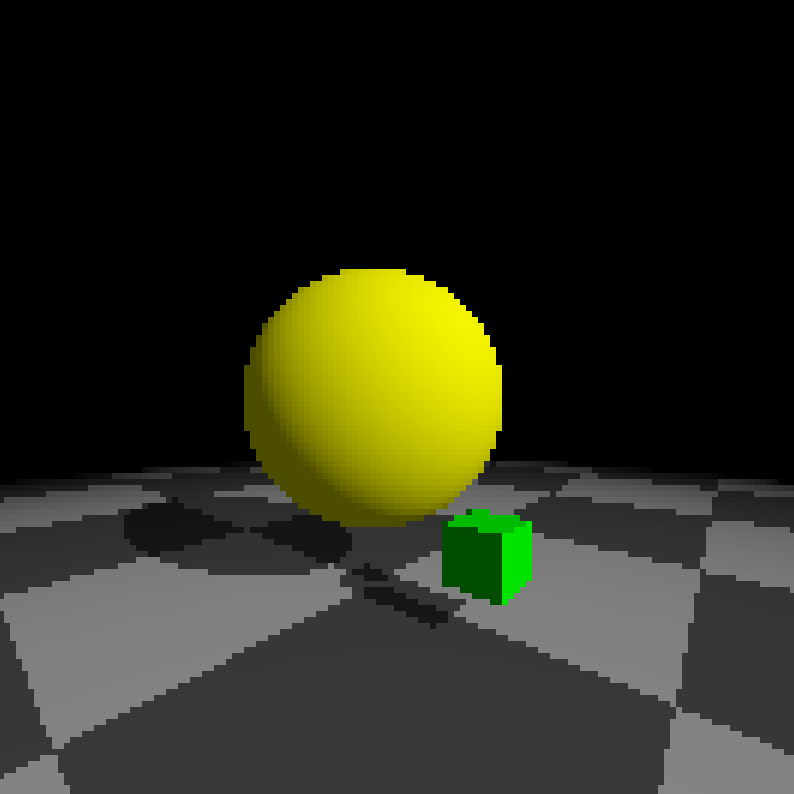

raymarcher
==========

Raymarcher written with gloss-raster. Currently runs on the CPU.



Build
-----

Install `stack` using GHCUp, then

```
sudo apt install freeglut3-dev
cd raymarcher
stack build
```

Then use `stack run` to run the program.

Controls
--------

- 'w', 'a', 's', 'd' : move forward/backward/left/right
- 'h', 'l' : turn left/right
- left/right arrow : change light direction
